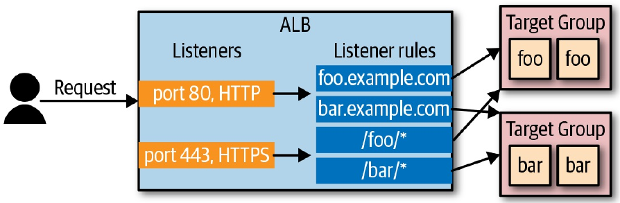

透過 ASG 產生出來的 EC2 instance 都有各自不同的 ip，但我們需要讓使用者可以有個單獨的 IP 可以存取到後端的 server，就會需要 Load Balancer。

AWS 提供三種 Load Balancer：

- Application Load Balancer
> 處理 HTTP & HTTPS

- Network Load Balancer
> 可處理 TCP/UDP & TLS 流量，比起 ALB  在針對負載的回應 scale up & down 時的速度更快

- Classic Load Balancer
> 包含上面兩種 LB 的能力，但少了很多功能

## ALB

ALB 包含三個部份需要設定：

- Listener

- Listerner Rule

- Target Group

